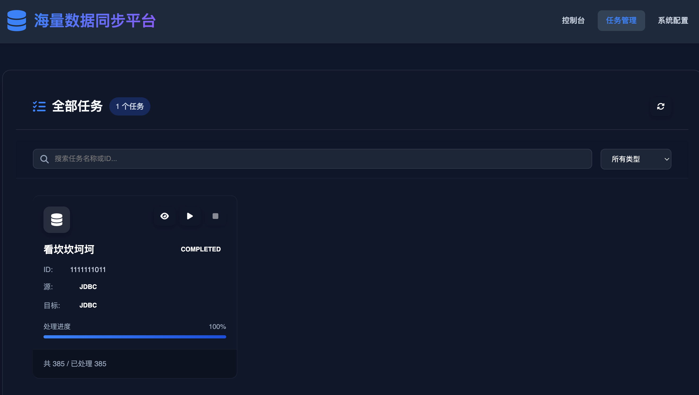

<h1 align="center">Vue 3 + Vite 数据同步服务管理平台</h1>

<h1>项目概述</h1>
基于 Vue 3 + Vite + TypeScript + Element Plus 构建的数据同步服务管理平台，包含同步平台、任务管理和任务配置三大核心模块。

🖥️ 界面预览

✨ 功能特性
1. 同步平台
   实时监控：展示同步任务运行状态和健康度

数据统计：同步任务数量、成功/失败率、数据量统计

运行日志：实时查看同步任务的执行日志

快速操作：一键启停、手动触发同步

2. 任务管理
   任务列表：查看所有同步任务的基本信息

状态管理：启动、停止、暂停、恢复同步任务

历史记录：查看任务执行历史记录

异常告警：任务失败自动告警和重试机制

3. 任务配置
   新建任务：向导式创建新的数据同步任务

配置管理：源数据源、目标数据源、同步规则配置

映射配置：字段映射、数据转换规则

调度设置：定时任务、触发条件设置

🚀 快速开始
环境要求
Node.js 16+ 或 18+

npm 7+ 或 yarn 1.22+ 或 pnpm 7+

安装步骤
bash
# 克隆项目
git clone https://github.com/gzwUtils/sync-platform.git

# 进入项目目录
cd data-sync-platform

# 安装依赖
npm install
# 或使用 yarn
yarn install
# 或使用 pnpm
pnpm install

# 启动开发服务器
npm run dev
# 或
yarn dev
# 或
pnpm dev
构建部署
bash
# 构建生产版本
npm run build

# 预览构建结果
npm run preview

# 部署到服务器
# 将 dist 目录上传到 Web 服务器

🐛 常见问题
1. 安装依赖失败
   bash
# 清理缓存并重试
npm cache clean --force
rm -rf node_modules
npm install
2. 开发服务器启动失败
   检查端口占用：

bash
# Linux/Mac
lsof -i :3000

# Windows
netstat -ano | findstr :3000
3. Element Plus 图标不显示
   确保正确安装并注册图标：

bash
npm install @element-plus/icons-vue
📄 许可证
本项目基于 MIT 许可证开源。详见 LICENSE 文件。

🤝 贡献指南
欢迎提交 Issue 和 Pull Request 来改进这个项目。

Fork 本仓库

创建功能分支 (git checkout -b feature/xxx)

提交更改 (git commit -m 'feat: add some feature')

推送到分支 (git push origin feature/xxx)

提交 Pull Request

提交规范
feat: 新功能

fix: 修复问题

docs: 文档更新

style: 代码格式调整

refactor: 代码重构

test: 测试相关

chore: 构建过程或辅助工具的变动

📞 联系方式
如有问题或建议，请通过以下方式联系：

邮箱：[18843096270@163.com]
